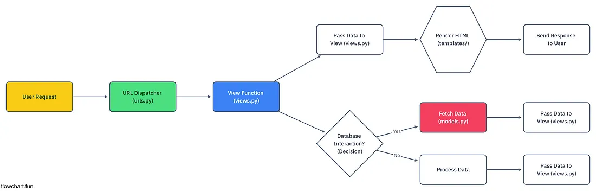

LINK PWS: https://putri-hamidah-cscorner.pbp.cs.ui.ac.id

IMPLEMENTASI STEP BY STEP
1. Membuat direktori dan repositori github untuk CS Corner
2. Mengaktifkan virtual environment
3. Menyiapkan Dependencies dengan membuat requirements.txt dan membuat proyek Django bernama CScorner
4. Membuat .env dan .env.prod sesuai kredensial database
5. Modifikasi settings.py
6. migrate dan runserver (routing) untuk check apakah udah ada animasi roket di localhost
7. git add, commit "unggah proyek done", dan push
8. Membuat proyek cscorner di PWS, ubah environs, tambahkan URL deployment PWS di settings.py
9. Menambahkan .gitignore serta add, commit "pws", dan push ke github. Dan juga remote add pws, branch, dan push pws
10. Membuat aplikasi 'main', modifikasi settings.py yang INSTALLED_APPS
11. Di main, buat direktori templates lalu buat main.html yang berisi nama aplikasi, nama, dan kelas
12. Modifikasi models.py sesuai atribut yang saya inginkan, lalu migrasi model
13. Integrasi komponen MVT dengan tambahkan modul render dan show_main pada views.py di main, terus modifikasi template main.html yang udah di definisikam dalam context
14. Konfigurasi routing URL di urls.py aplikasi main. Lalu modifikasi urls.py CScorner
15. Routing dengan runserver dan check localhost
16. Push ke github, commit "sebelum unit test", dan juga push pws. Saat check link PWS, hasilnya 404 not found
17. Setelah di check, ada SyntaxError di models.py
18. Migrate dan routing runserver lagi. Localhost sudah menampilkan halamannya
19. Add, commit "push otw deploy", push ke github dan pws
20. Modifikasi isi README, lalu add, commit "finish + update readme", push ke github

BAGAN REQUEST CLIENT KE WEB

Link referensi: https://medium.com/pythons-gurus/understanding-djangos-workflow-a-visual-guide-adb3867fb042 
Alur dimulai ketika pengguna mengirimkan user request dari peramban web ke Django. 
* urls.py
Request ini berupa URL yang akan diterima oleh URL Dispatcher (urls.py). Django mencocokan URL dengan pola yang ada di urls.py. 
* views.py
Jika cocok, request diteruskan ke View (views.py). Jika tidak cocok, Django memberi output 404 Not Found. View menangani logika yang ditampilkan pengguna.
* models.py
Jika perlu data dari database, View memanggil Model (models.py) untuk mengambil dan memproses data, lalu hasilnya dikembalikan ke View. Model bertugas untuk mengatur dan mengelola data pada sebuah aplikasi.
* berkas HTML
Setelah itu, View mengirim data ke Template agar diubah menjadi halaman HTML. Template adalah berkas HTML yang menampilkan data yang dikirimkan oleh view. Halaman HTML yang sudah jadi dikirim kembali ke pengguna dan ditampilkan di peramban web.

PERAN settings.py
1. Mendaftarkan semua aplikasi yang aktif dalam proyek di INSTALLED_APPS. Dengan mendaftarkan aplikasi, Django menemukan models.py, template, dan berkasi lain dari aplikasi tersebut.
2. Mengatur konfigurasi database di DATABASES. DATABASES adalah inti dari koneksi Django dengan database. Disini, ada engine database yang digunakan, nama databasem kredensial pengguna, host, dan port. Dengan konfigurasi, Django dapat berinteraksi dengan database tanpa perlu menulis kode SQL yang masih raw.
3. Mendefinisikan lokasi urls.py utama. ROOT_URLCONF memberi tahu Django menemukan file urls.py utama proyek. File ini memproses dan mengarahkan setiap request yang masuk ke aplikasi.
4. Mengatur konfigurasi template di TEMPLATES untuk memproses file template HTML. Saat APP_DIRS true, Django mencari folder templates di aplikasi yang ada di INSTALLED_APPS. context_processors menambahkan variabel ke template, seperti request, auth, dan messages.
5. Menentutan static files (CSS, JavaScript, Images). STATIC_URL mendefinisikan URL untuk static file

CARA KERJA MIGRASI DATABASE
Migrasi database adalah fitur Django yang mengelola perubahan skema basis data. Proses ini terdiri dari dua langkah yang wajib dilakukan setiap kali mengubah model di file models.py
1. Menjalankan perintah python manage.py makemigrations
Django memindah semua perubahan pada model. Perintah ini akan membuat migrasi baru di dalam folder migrations aplikasi. File ini berisi langkah-langkah untuk mengubah  struktur tabel agar sesuai dengan model.
2. Menjalankan perintah python manage.py migrate
Django membaca file migrasi di langkah sebelumnya dan menerapkan instruksi di dalam basis data. Perintah ini membuat, mengubah, atau menghapus tabel di basis data, sesuai definisi model yang baru. Django juga melacak migrasi mana saja yang sudah diterapkan agar tidak dijalankan dua kali.

ALASAN Django MENJADI PERMULAAN BELAJAR PERANGKAT LUNAK
1. Django menggunakan pola MVT (model, view, template) yang mempermudah pemula memahami dan mengelola setiap bagian aplikasi.
2. Proyek Django memiliki struktur yang teratur sehingga mudah dikelola, diuji, dan diperluaskan.
3. Django berbasis Python, bahasa pemrograman yang mudah dipahami dan dibaca.

FEEDBACK TUTORIAL 1
Tidak ada. Tutorial 1 dapat dipahami dengan baik serta asdos juga stand by di Discord saat saya butuh bantuan.